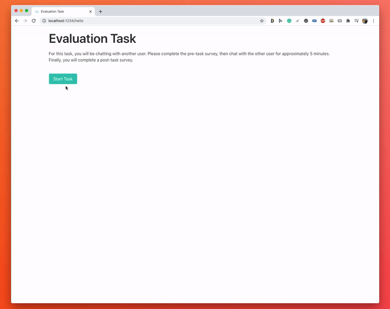

# A Framework for Automatic Evaluation of Dialogue Models

## Features
- Custom/optional pre-task & post-task surveys
- Configure multiple chatbots/agents per task
- Custom chatbot/agent colors
- Optionally unique personas for each chatbot
- Launch your task on Amazon Mechanical Turk
- Completely configurable settings
- Launch your task on Amazon Mechanical Turk hassel free
- And much more!

## Installation
We are currently in our alpha testing stage. Install instructions coming soon.

## Quickstart Guide
Navigate to `app/` to learn about how to get started with the framework.
